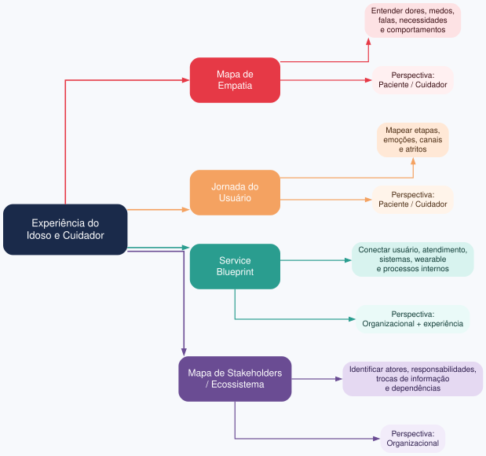

# Exercício 1 - Diagramas de alinhamento

## Quadro de diagramas

Quatro diagramas orientam o projeto: Mapa de Empatia e Jornada do Usuário olham pela perspectiva do paciente/cuidador; Service Blueprint e Mapa de Stakeholders/Ecossistema incorporam a visão organizacional, sistemas e processos.

## Cenário: cuidador recebe alerta de queda

**Perspectiva do cuidador:** sente medo, culpa e urgência. Quer saber se a queda foi real, se o idoso está consciente e o que fazer. Precisa de ação rápida, linguagem simples e confiança.

**Perspectiva da Vitalis Care:** o alerta vem do wearable + IA. Precisa classificar risco, evitar falso positivo, acionar protocolo, registrar evidências e cumprir SLA. Mede precisão, tempo de resposta, custo e risco jurídico.

**Divergências:**
1. Cuidador quer ação imediata; empresa equilibra sensibilidade da IA e falsos positivos.
2. Cuidador quer instrução personalizada; empresa segue protocolo e compliance.
3. Cuidador avalia por alívio/medo; empresa avalia por KPIs e risco legal.

## Justificativa

Registrar essas perspectivas antes de desenhar o alerta evita decisões por intuição, cria critério comum de priorização, define requisitos de UX (clareza, confiança, ação) e garante que o alerta sirva ao cuidado real, não apenas à métrica da empresa.