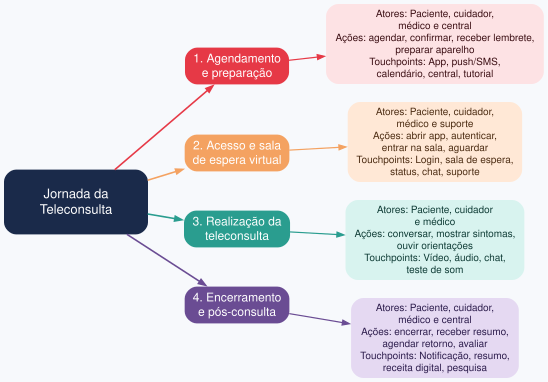

# Exercício 2 - Estrutura da jornada de teleconsulta

## Mapa de experiência da teleconsulta

A jornada foi dividida em quatro fases: agendamento e preparação, acesso e sala de espera virtual, realização da teleconsulta e encerramento/pós-consulta. Cada fase reúne atores, ações e touchpoints.

## Touchpoints e momentos da verdade

**Touchpoints:** sala de espera virtual, indicador de status da consulta, login/autenticação, botão "entrar na chamada", permissão de acesso do cuidador, áudio/vídeo, diagnóstico de dispositivo, mensagem de erro e suporte técnico.

**Momentos da verdade:**
- Não saber se a consulta já começou ou se ainda está na sala de espera.
- Precisar que o cuidador entre na chamada porque o idoso não confia em mexer sozinho.
- Áudio falha e não saber se o problema é do aparelho do paciente ou do médico.
- Decidir continuar, pedir ajuda ou desistir da teleconsulta.

## Touchpoints prioritários para investigação

Critérios: impacto no cuidado (1–5), frequência de uso (1–5) e prioridade = impacto × frequência.

| Touchpoint | Impacto | Frequência | Prioridade |
|---|---|---|---|
| Sala de espera virtual / status da consulta | 5 | 5 | 25 |
| Áudio/vídeo e diagnóstico de falha | 5 | 4 | 20 |
| Permissão de acesso do cuidador | 4 | 4 | 16 |