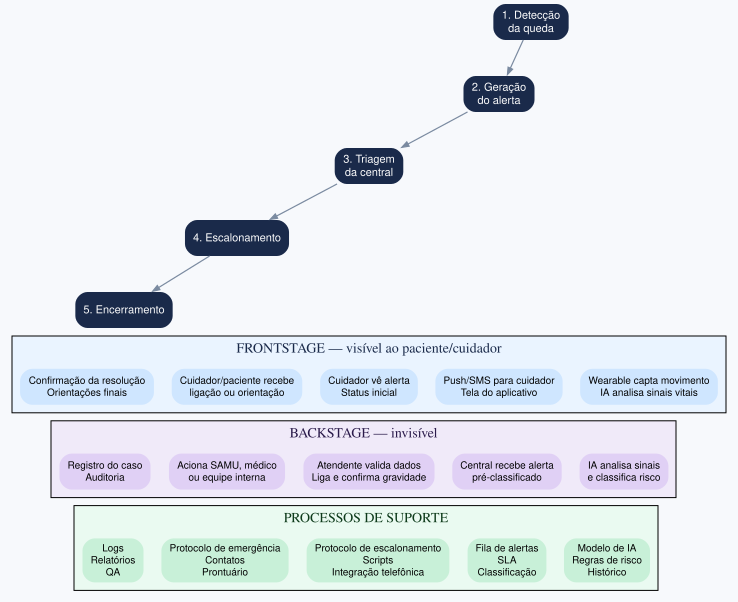

# Exercício 4 - Service Blueprint do alerta de emergência

## Service Blueprint: detecção de queda → resposta humana

A linha de visibilidade separa o que o paciente/cuidador vê (notificações, status, ligações) das ações internas da central, da IA e dos protocolos. O blueprint cobre cinco etapas: detecção da queda, geração do alerta, triagem da central, escalonamento e encerramento.

| Etapa | Frontstage (visível) | Backstage (invisível) | Processos de suporte |
|---|---|---|---|
| **1. Detecção da queda** | Wearable capta movimento; IA analisa sinais vitais e padrão de queda | Wearable capta dados; IA analisa sinais e classifica risco | Modelo de IA, regras de risco, histórico do paciente |
| **2. Geração do alerta** | Notificação push/SMS para cuidador; tela do aplicativo | Central recebe alerta pré-classificado pela IA | Fila de alertas, SLA, classificação de risco |
| **3. Triagem da central** | Cuidador vê alerta recebido e status inicial | Atendente valida dados, liga para cuidador/paciente, confirma gravidade | Protocolo de escalonamento, scripts, integração telefônica |
| **4. Escalonamento** | Cuidador/paciente recebe ligação, orientação ou visita | Atendente aciona SAMU, médico ou equipe interna e registra decisão | Protocolo de emergência, contatos, prontuário |
| **5. Encerramento** | Confirmação da resolução e orientações finais | Registro do caso, auditoria e acompanhamento | Logs, relatórios, QA, melhoria contínua |

## Falhas operacionais evidentes só no backstage

1. **Fila sem priorização dinâmica:** alerta grave pode esperar atrás de falsos positivos.
2. **Protocolo de escalonamento ambíguo:** atendente não sabe quando acionar SAMU ou apenas contatar cuidador.
3. **Falta de timestamps por etapa:** impossível reconstruir onde ocorreu o atraso depois do incidente.

## Impacto da experiência dos atendentes na resposta ao paciente

- **Carga alta de alertas:** gera fadiga, triagem superficial e atraso.
- **Protocolo claro:** decisão rápida, padronizada e segura.
- **Ferramentas integradas:** histórico, contato e script em uma única tela reduzem erros.
- **Ferramentas fragmentadas:** causam retrabalho, confusão e demora.
- **Sem autonomia:** o atendente segue a IA mesmo discordando, piorando a resposta em emergência real.

## Avaliação da interface de classificação de risco por IA

A IA classifica o risco, mas o atendente precisa entender o porquê. A interface deve mostrar os fatores explicativos (aceleração, imobilidade, histórico de quedas, confiança do modelo) e permitir três ações: concordar, ajustar risco ou solicitar revisão. Ajustes exigem justificativa obrigatória. Também deve existir override manual para acionar emergência imediatamente, mesmo que a IA discorde.

**Transparência:** mostrar fatores explicativos da classificação.
**Agência:** permitir revisão e ajuste da classificação com justificativa.
**Controle:** permitir override manual e acionamento de emergência.