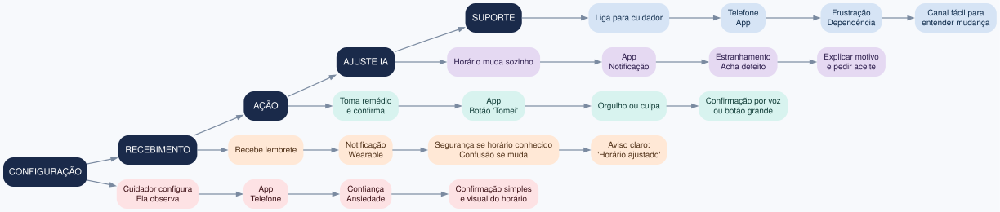
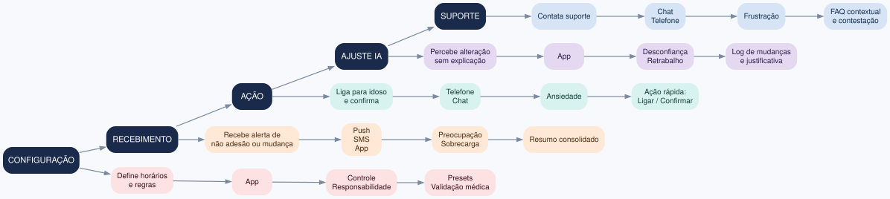
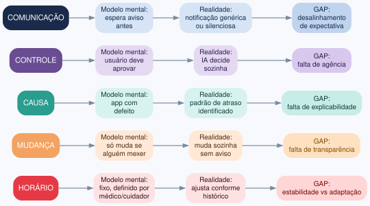

# Exercício 5 - Experience maps e modelo mental do alerta inteligente

## Personas

**Persona 1 - Paciente idoso: Dona Maria, 74 anos**
Prefere rotina fixa e horários previsíveis. Tem baixa familiaridade com tecnologia e depende do cuidador para configurar o app. Sente insegurança quando o aplicativo muda algo sozinho.

**Persona 2 - Cuidador familiar: João, 45 anos**
Monitora o app várias vezes ao dia. Quer controle, previsibilidade e alertas confiáveis. Tem sobrecarga de responsabilidade e pouco tempo.

## Experience Map: Paciente idoso

| Fase | Ação | Touchpoint | Emoção | Oportunidade |
|---|---|---|---|---|
| **Configuração** | Cuidador configura; ela observa | App, telefone | Confiança, ansiedade | Confirmação simples e visual do horário |
| **Recebimento** | Recebe lembrete | Notificação, wearable | Segurança se horário conhecido; confusão se muda | Aviso claro: "Horário ajustado" |
| **Ação** | Toma remédio e confirma | App, botão "Tomei" | Orgulho ou culpa | Confirmação por voz ou botão grande |
| **Ajuste IA** | Horário muda sozinho | App, notificação | Estranhamento; acha defeito | Explicar motivo e pedir aceite |
| **Suporte** | Liga para cuidador | Telefone, app | Frustração, dependência | Canal fácil para entender mudança |

## Experience Map: Cuidador

| Fase | Ação | Touchpoint | Emoção | Oportunidade |
|---|---|---|---|---|
| **Configuração** | Define horários e regras | App | Controle, responsabilidade | Presets e validação médica |
| **Recebimento** | Recebe alerta de não adesão ou mudança | Push, SMS, app | Preocupação, sobrecarga | Resumo consolidado |
| **Ação** | Liga para idoso e confirma | Telefone, chat | Ansiedade | Ação rápida: ligar / confirmar |
| **Ajuste IA** | Percebe alteração sem explicação | App | Desconfiança, retrabalho | Log de mudanças e justificativa |
| **Suporte** | Contata suporte | Chat, telefone | Frustração | FAQ contextual e contestação |

## Mental Model Diagram - "Por que o horário do lembrete mudou?"

| Tema | Modelo mental do usuário | Funcionamento real da IA | Gap |
|---|---|---|---|
| **Horário** | Deve ser fixo, definido por médico/cuidador | Ajusta conforme histórico de adesão e atrasos | Estabilidade vs adaptação |
| **Mudança** | Só muda se alguém mexer | Muda automaticamente sem aviso claro | Falta de transparência |
| **Causa** | App com defeito ou erro | Padrão de atraso recorrente identificado pela IA | Falta de explicabilidade |
| **Controle** | Usuário deve aprovar mudanças | IA decide sozinha | Falta de agência |
| **Comunicação** | Espera aviso antes | Notificação genérica ou silenciosa | Desalinhamento de expectativa |

## Comparação dos diagramas

O Experience Map orienta melhorias de jornada e interface, mostrando onde e quando o usuário se frustra no uso contínuo do lembrete. O Mental Model Diagram orienta explicabilidade, comunicação e controle da IA, contrastando a expectativa do usuário com o funcionamento real do sistema. Os dois são complementares: o primeiro mostra o percurso; o segundo explica a confusão cognitiva.