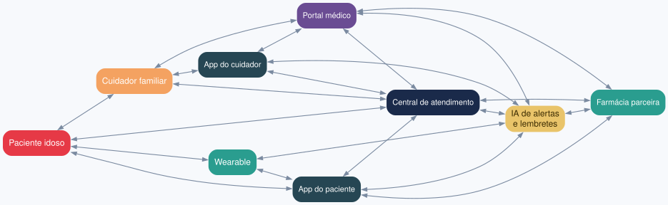
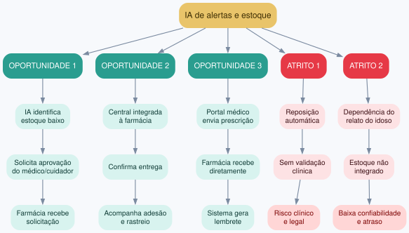
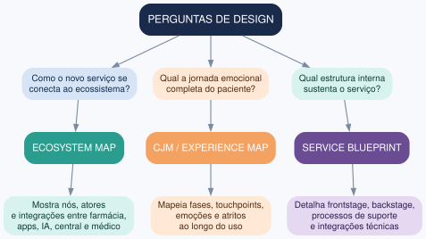

# Exercício 6 - Ecossistema Vitalis Care

## 1. Modelagem do ecossistema

O ecossistema reúne paciente idoso, cuidador familiar, wearable, apps, portal médico, central de atendimento, IA de alertas e lembretes e farmácia parceira. As trocas de informação acontecem em múltiplas direções, e a IA atua como núcleo de mediação entre sinais do wearable, decisões clínicas e ações da central.

**Fluxo simplificado:** Paciente ↔ Wearable ↔ IA ↔ Central ↔ Cuidador/Médico. App do paciente ↔ IA ↔ Farmácia. Portal médico ↔ IA ↔ Farmácia. Central ↔ Farmácia.

## 2. Oportunidades de integração e pontos de atrito

**Oportunidades:**
1. IA identifica estoque baixo → solicita aprovação do médico/cuidador → farmácia recebe solicitação.
2. Central integrada à farmácia → confirma entrega → acompanha adesão e rastreio.
3. Portal médico envia prescrição → farmácia recebe diretamente → sistema gera lembrete.

**Atritos:**
1. Reposição automática sem validação clínica → risco clínico e legal.
2. Dependência do relato do idoso → estoque não integrado ao sistema → baixa confiabilidade e atraso.

## 3. Mapa adequado para cada pergunta de design

| Pergunta de design | Mapa adequado | Por quê |
|---|---|---|
| Como o novo serviço se conecta ao ecossistema? | Ecosystem Map | Mostra nós, atores e integrações entre farmácia, apps, IA, central e médico |
| Qual a jornada emocional completa do paciente usando o novo serviço? | Customer Journey Map / Experience Map | Mapeia fases, touchpoints, emoções e atritos ao longo do uso |
| Qual estrutura interna sustenta o serviço? | Service Blueprint | Detalha frontstage, backstage, processos de suporte e integrações técnicas |