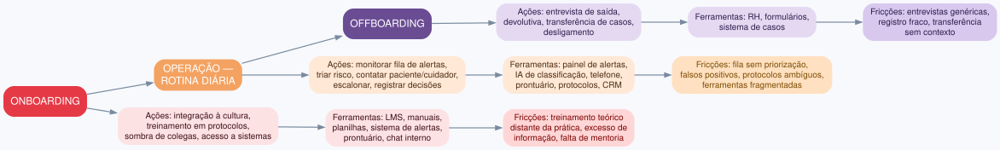
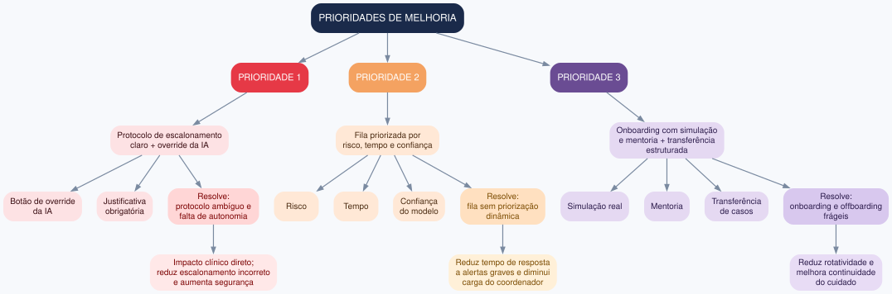

# Exercício 7 - Jornada do coordenador de cuidados

## 1. Mapa da jornada do coordenador

A jornada foi dividida em três grandes momentos: onboarding, operação (rotina diária) e offboarding. Para cada um, mapeei ações, ferramentas e pontos de fricção.

| Momento | Ações | Ferramentas | Pontos de fricção |
|---|---|---|---|
| **Onboarding** | Integração à cultura, treinamento em protocolos, sombra de colegas, acesso a sistemas, primeiros pacientes | LMS, manuais, planilhas, sistema de alertas, prontuário, chat interno | Treinamento teórico distante da prática, excesso de informação, falta de mentoria, acesso fragmentado |
| **Operação rotina diária** | Monitorar fila de alertas, triar risco, contatar paciente/cuidador, escalonar médico/SAMU, registrar decisões, acompanhar casos | Painel de alertas, IA de classificação, telefone, prontuário, protocolos, CRM, chat | Fila sem priorização dinâmica, falsos positivos, protocolos ambíguos, ferramentas fragmentadas, interrupções constantes, pressão por tempo, falta de autonomia para contestar IA |
| **Offboarding** | Entrevista de saída, devolutiva, transferência de casos, desligamento | RH, formulários, sistema de casos | Entrevistas genéricas, falta de registro estruturado, transferência sem contexto, sobrecarga para quem fica |

## 2. Duas lacunas internas de maior impacto e propagação até o paciente

**Lacuna 1: Fila de alertas sem priorização dinâmica e alto volume de falsos positivos**
- Onde ocorre: operação - monitoramento da fila de alertas.
- Propagação: o coordenador gasta tempo em alertas irrelevantes → alertas graves esperam → tempo de resposta aumenta → paciente/cuidador espera mais, risco clínico e frustração.
- Sintoma reconhecido pela diretoria: aumento do tempo de resposta a alertas.

**Lacuna 2: Protocolo de escalonamento ambíguo e falta de autonomia para contestar a IA**
- Onde ocorre: operação - triagem e escalonamento.
- Propagação: coordenador não sabe quando escalar ou segue a IA mesmo discordando → escalonamento incorreto (sub ou sobre-escalonamento) → paciente grave sem resposta ou recursos desperdiçados.
- Sintoma reconhecido pela diretoria: alta taxa de escalonamento incorreto.

## 3. Três melhorias de fluxo interno

| Prioridade | Melhoria | Resolve | Justificativa |
|---|---|---|---|
| **1** | Protocolo de escalonamento claro + override da IA com justificativa | Lacuna 2 - protocolo ambíguo e falta de autonomia | Impacto clínico direto; reduz escalonamento incorreto e aumenta segurança do paciente |
| **2** | Fila priorizada por risco, tempo e confiança do modelo | Lacuna 1 - fila sem priorização dinâmica | Reduz tempo de resposta a alertas graves e diminui carga sobre o coordenador |
| **3** | Onboarding com simulação real e mentoria + transferência estruturada de casos no offboarding | Onboarding e offboarding frágeis | Reduz rotatividade, melhora continuidade do cuidado e diminui sobrecarga da equipe |

Critério de priorização: gravidade do impacto clínico × frequência na rotina × esforço de implementação.