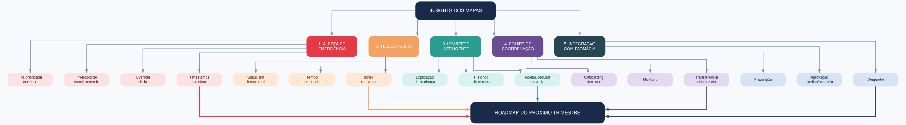

# Exercício 8 - Insights estratégicos para o roadmap

## Insights priorizados

| Prioridade | Insight estratégico | Evidência nos mapas | Impacto | Viabilidade no trimestre | Requisito de produto |
|---|---|---|---|---|---|
| 1 | O alerta de emergência perde tempo por fila sem priorização, protocolo ambíguo e falta de registro por etapa | Service Blueprint (Ex. 4) e jornada do coordenador (Ex. 7) | Crítico | Média | Fila priorizada por risco, protocolo claro de escalonamento, override da IA e timestamps por etapa |
| 2 | A confiança do paciente despenca na sala de espera virtual da teleconsulta | CJM e gaps emocionais (Ex. 3) | Alto | Alta | Status em tempo real: "aguardando médico", "médico entrou", "consulta iniciada", tempo estimado e botão de ajuda |
| 3 | O lembrete inteligente muda horários sem explicar, quebrando o modelo mental do usuário | Experience Map e Mental Model (Ex. 5) | Alto | Média | Notificar mudanças com motivo, histórico de ajustes e opção de aceitar, recusar ou ajustar |
| 4 | A rotatividade dos coordenadores afeta o tempo de resposta e a taxa de escalonamento incorreto | Jornada do coordenador (Ex. 7) | Médio/Alto | Alta | Onboarding simulado, mentoria e transferência estruturada de casos |
| 5 | A integração com farmácia exige validação clínica antes da reposição automática | Ecossistema (Ex. 6) | Médio | Baixa | Fluxo de reposição com prescrição e aprovação do médico/cuidador antes do despacho |

## Roadmap do próximo trimestre

O roadmap organiza as cinco frentes priorizadas a partir dos insights dos mapas. Cada frente agrupa requisitos que resolvem lacunas específicas identificadas nos exercícios anteriores.