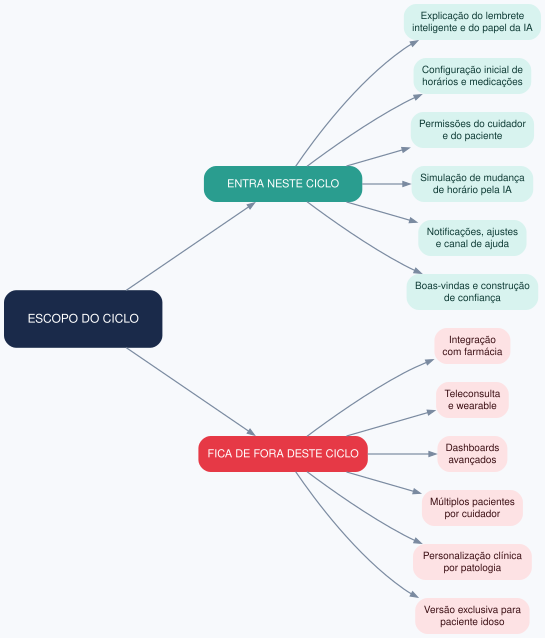
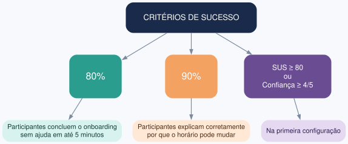
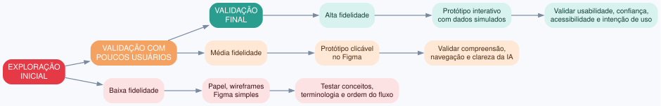

# Exercício 9 - Escopo e prototipação

## 1. Escopo do ciclo

**Entra neste ciclo:**
- Explicação do lembrete inteligente e do papel da IA
- Configuração inicial de horários e medicações
- Permissões do cuidador e do paciente
- Simulação de mudança de horário pela IA
- Notificações, ajustes e canal de ajuda
- Boas-vindas e construção de confiança

**Fica de fora deste ciclo:**
- Integração com farmácia
- Teleconsulta e wearable
- Dashboards avançados
- Múltiplos pacientes por cuidador
- Personalização clínica por patologia
- Versão exclusiva para paciente idoso

## 2. Critérios de sucesso mensuráveis

| Métrica | Meta |
|---|---|
| Conclusão do onboarding sem ajuda | 80% dos participantes em até 5 minutos |
| Compreensão do motivo da mudança de horário | 90% dos participantes explicam corretamente após o teste |
| Satisfação e confiança | SUS ≥ 80 ou confiança autodeclarada ≥ 4/5 na primeira configuração |

## 3. Tipo de protótipo por fase

| Fase | Tipo de protótipo | Justificativa |
|---|---|---|
| Exploração inicial | Baixa fidelidade: papel, wireframes ou Figma simples | Testar conceitos, terminologia e ordem do fluxo sem custo alto |
| Validação com poucos usuários | Média fidelidade: protótipo clicável no Figma | Validar compreensão, navegação e clareza das explicações da IA |
| Validação final | Alta fidelidade interativo com dados simulados | Validar usabilidade, confiança, acessibilidade e intenção de uso |

## 4. Perfil ideal de participante

Cuidadores familiares de idosos com condições crônicas, entre 25 e 70 anos, com diferentes níveis de familiaridade tecnológica. Incluir:
- cuidador que mora com o idoso;
- cuidador que monitora remotamente;
- cuidador com baixa familiaridade digital;
- cuidador com alta familiaridade digital;
- responsáveis pela administração de medicamentos.

## 5. Roteiro de screening - 5 perguntas

1. Qual sua idade?
2. Como você avalia sua familiaridade com aplicativos de celular: baixa, média ou alta?
3. Você é responsável por organizar e acompanhar a medicação de um idoso?
4. Você já usou algum lembrete de medicação, aplicativo ou alarme?
5. Você mora com o idoso ou o acompanha remotamente?