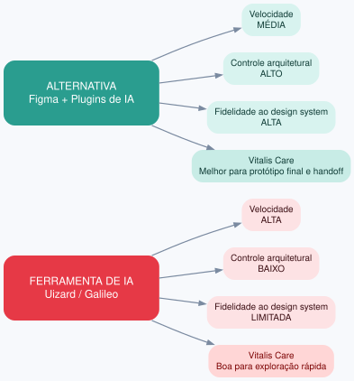

# Exercício 11 - Protótipo de alta fidelidade com IA e refinamento

## 1. Esboço de referência - primeira tela do onboarding do cuidador

**Tela 1: Boas-vindas e explicação da IA**
- Título: "Bem-vindo ao Lembrete Inteligente"
- Texto curto: "A IA ajusta horários conforme sua rotina. Você pode aceitar, ajustar ou desfazer quando quiser."
- Ilustração simples do cuidador + idoso + app
- Botões: "Começar configuração" e "Saber mais"
- Rodapé: link "Preciso de ajuda"

**Prompt de geração por imagem (v1):**
"Tela mobile de onboarding para cuidador familiar, título 'Bem-vindo ao Lembrete Inteligente', texto explicando que a IA ajusta horários, botões 'Começar' e 'Saber mais', alto contraste, botões grandes, acessível para idosos."

## 2. Revisão do resultado gerado

**Problema encontrado:** a primeira versão não contemplava o caso do wearable ainda não vinculado, exibindo apenas a configuração de medicação.

**Prompt ajustado (v2):** incluir bloco "Status do wearable" com dois estados: "Vinculado" e "Ainda não vinculado — vincular agora", com botão de ação e explicação de que o lembrete funciona mesmo sem o wearable, mas o monitoramento completo exige vínculo.

**O que foi corrigido:** adição do card de status do wearable, botão de vínculo e mensagem de impacto no lembrete.

## 3. Iterações adicionais de refinamento

| Iteração | O que foi solicitado | O que mudou |
|---|---|---|
| 1 | Destacar explicação da IA e controle do cuidador | Inclusão de frase "A IA pode ajustar o horário, mas você decide" e botão "Ver como funciona" |
| 2 | Melhorar acessibilidade e linguagem | Aumento de fonte, contraste, substituição de termos técnicos por linguagem simples, botões maiores |

## 4. Explicação da IA sobre "desfazer ajuste automático"

**Explicação da ferramenta:** "Dar ao cuidador a opção de desfazer um ajuste automático aumenta a confiança porque devolve o controle ao usuário. Ele percebe que a IA é uma assistente, não uma autoridade que decide sozinha, e pode corrigir erros sem medo."

**Avaliação crítica:**
- **Captura bem:** a ideia de controle percebido, redução de sensação de imposição e reforço de que a IA é assistiva.
- **Simplifica:** não aborda custo cognitivo de monitorar ajustes, nem o risco de o usuário desfazer ajustes benéficos por desconfiança. Também ignora que agência real exige explicabilidade (entender por que mudou) e não só um botão de desfazer.

## 5. Comparação entre ferramentas AI-native

| Critério | Ferramenta usada (Uizard/Galileo) | Alternativa (Figma + plugins de IA) |
|---|---|---|
| Velocidade | Alta: gera tela a partir de imagem/prompt | Média: exige mais configuração manual |
| Controle arquitetural | Baixo: estrutura de componentes pouco editável | Alto: componentes, grids e design system controláveis |
| Fidelidade ao design system | Limitada | Alta, com bibliotecas próprias |
| Adequação ao Vitalis Care | Boa para exploração rápida | Melhor para protótipo final e handoff |

**Justificativa:** a ferramenta AI-native acelera a exploração, mas a alternativa oferece mais controle sobre acessibilidade, componentes e consistência — essencial para um produto que lida com idosos e confiança.