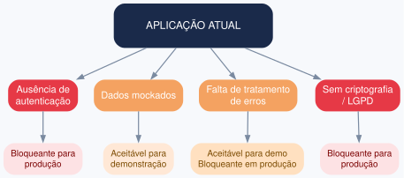
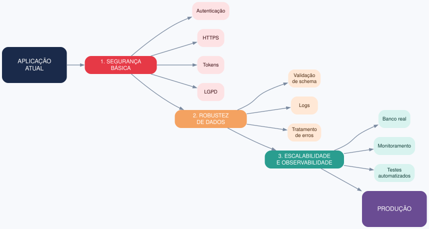

# Exercício 12 - Da prototipagem à produção

## 1. Aplicação web mínima

Montei do zero uma aplicação para testar o fluxo de onboarding do cuidador junto com o status do wearable, seguindo a tela definida no Exercício 11.

**Estrutura do projeto:**

- `backend/package.json`
- `backend/server.js`
- `backend/routes/wearable.js`
- `frontend/index.html`

**Backend (Node/Express):**
- `GET /api/wearable-status` → retorna `{ vinculado, ultimaSincronizacao }`
- `POST /api/wearable/vincular` → marca o wearable como vinculado, guarda a data da sincronização e retorna a confirmação

**Decisões de integração:**
- O frontend consome os endpoints com `fetch` e mostra o estado na tela: "Não vinculado" ou "Vinculado". Se o backend estiver fora do ar, aparece "Offline" e uma mensagem de erro.
- O CORS está liberado sem restrição (`cors()` em `server.js`) para o `index.html` conseguir chamar a API a partir de outra origem. Isso serve só para a demonstração e precisa ser restringido antes de produção.
- O estado do wearable fica em uma variável em memória, sem banco de dados. Ao reiniciar o servidor, ele volta para "não vinculado".

## 2. Limitações arquiteturais

| Limitação | Evidência na aplicação | Classificação |
|---|---|---|
| Sem autenticação/autorização | Nenhuma rota exige login ou token. Qualquer requisição `POST /api/wearable/vincular` altera o estado, e o `cors()` aceita qualquer origem | Bloqueante para produção |
| Sem criptografia / LGPD | O frontend chama `http://localhost:3000`, sem HTTPS | Bloqueante para produção |
| Dados mockados, sem validação | O estado é uma variável global em memória, sem identificação de paciente e sem schema | Aceitável para demonstração |
| Sem tratamento de erros e logs | As rotas não têm `try/catch` e o único log é a mensagem de inicialização do servidor | Aceitável para demonstração |

## 3. Estratégia de evolução para produção

| Etapa | Ação | Limitação resolvida |
|---|---|---|
| 1. Segurança básica | Autenticação com tokens, HTTPS, CORS restrito ao domínio do app e adequação à LGPD | Sem autenticação e sem criptografia |
| 2. Robustez dos dados | Validação de schema, tratamento de erros e logs | Dados mockados sem validação e falta de erros/logs |
| 3. Escalabilidade e observabilidade | Banco de dados com o estado por paciente, monitoramento e testes automatizados | Estado global em memória e falta de observabilidade |

## 4. Risco inaceitável mesmo em demonstração interna

A limitação que eu não aceitaria nem em demonstração interna é a **falta de autenticação e de criptografia, se a aplicação usar dados reais de pacientes**.

Do jeito que está hoje, o risco é baixo, porque o backend guarda só se o wearable está vinculado e a data da sincronização, sem nenhum dado pessoal ou de saúde. Por isso, com dados fictícios, eu aceito rodar sem autenticação em uma demonstração interna.

Mesmo assim, o problema aparece no próprio código: como não existe login, qualquer pessoa que consiga chamar o endpoint marca o wearable como vinculado. Em uma versão real, o cuidador acharia que o monitoramento está ativo sem estar, e isso é um risco de confiabilidade em um produto de saúde.

**Decisão:** a demonstração interna só pode rodar com dados fictícios e em rede interna. Para usar dados reais, autenticação e HTTPS (etapa 1 da evolução) precisam estar prontos antes.