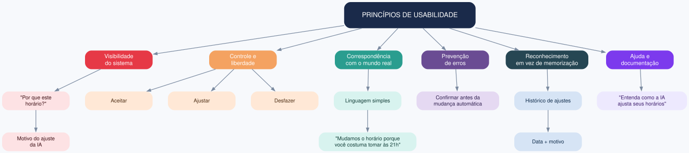

# Exercício 13 - Design centrado no humano para o lembrete inteligente

## 1. Princípios aplicados e decisões concretas de interface

| Princípio | Decisão concreta de interface |
|---|---|
| Visibilidade do sistema | Mostrar na tela "Por que este horário?" com o motivo do ajuste da IA |
| Controle e liberdade do usuário | Botões "Aceitar", "Ajustar" e "Desfazer" em cada mudança de horário |
| Correspondência com o mundo real | Linguagem simples: "Mudamos o horário porque você costuma tomar às 21h" |
| Prevenção de erros | Confirmação antes de aplicar mudança automática |
| Reconhecimento em vez de memorização | Histórico visível de ajustes com data e motivo |
| Ajuda e documentação | Link "Entenda como a IA ajusta seus horários" em cada tela |

## 2. Mecanismos de feedback e agência

**Mecanismo 1: Desfazer ajuste automático**
- Após a IA mudar o horário, aparece um card: "Horário ajustado de 20h para 21h. Motivo: atrasos recorrentes."
- Botões: "Manter", "Voltar ao anterior", "Escolher outro horário".
- A ação é registrada no histórico.

**Mecanismo 2: Contestar ou pausar a IA**
- Botão "Pausar ajustes automáticos" nas configurações.
- Ao pausar, o sistema mantém horários fixos e avisa: "Você pode reativar quando quiser."
- Opção "Não concordei com este ajuste" gera feedback para o time de produto.

## 3. Justificativa do risco da ausência de agência

No lembrete inteligente, a IA decide algo que afeta diretamente a rotina de saúde de um idoso. Sem agência, o paciente pode tomar remédio em horário errado por confiar cegamente na IA, o cuidador perde confiança e abandona o recurso, erros silenciosos podem causar dano clínico e a Vitalis Care fica exposta a risco ético, legal e reputacional. Não é só usabilidade: é segurança do paciente e responsabilidade sobre decisões automatizadas em saúde.