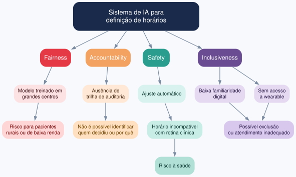
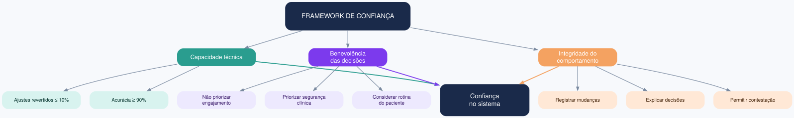

# Exercício 14 - Framework ético e auditoria de viés

## 1. Avaliação Fairness, Accountability, Safety e Inclusiveness

| Critério | Risco concreto |
|---|---|
| Fairness | Modelo treinado em grandes centros pode ajustar horários de forma inadequada para pacientes rurais ou de baixa renda |
| Accountability | Sem trilha de auditoria, não se sabe quem decidiu nem por que o horário foi ajustado |
| Safety | Ajuste automático pode levar a horários incompatíveis com a rotina clínica, causando risco à saúde |
| Inclusiveness | Idosos com baixa familiaridade digital ou sem acesso a wearable podem ser excluídos ou mal atendidos |

## 2. Framework de confiança — 3 dimensões

| Dimensão | Critério observável |
|---|---|
| Capacidade técnica | Modelo com acurácia ≥ 90% e taxa de ajustes revertidos ≤ 10% |
| Benevolência das decisões | Ajustes priorizam segurança clínica e rotina do paciente, não engajamento |
| Integridade do comportamento | Sistema registra, explica e permite contestar toda mudança automática |

## 3. Auditoria de usabilidade contra viés

**Grupos a comparar:**
- Idosos urbanos vs. rurais
- Alta vs. baixa familiaridade digital
- Com cuidador presente vs. monitoramento remoto
- Diferentes faixas de renda e escolaridade

**Sinais de viés:**
- Taxa de ajustes revertidos maior em um grupo
- Maior abandono do recurso em grupos específicos
- Compreensão do motivo do ajuste desigual entre perfis
- Tempo de configuração significativamente maior em alguns grupos