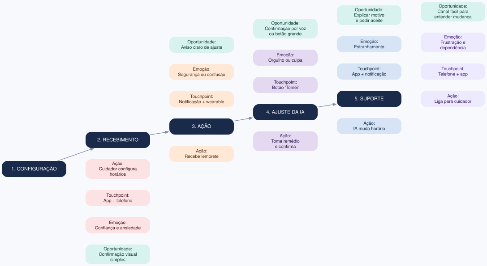
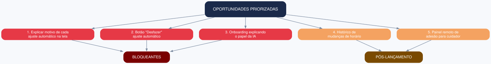

# Exercício 15 - Plano e execução de teste de usabilidade

## 1. Diagrama visual de experiência - layout escolhido

**Layout:** mapa horizontal por fases (linha do tempo), com colunas para Ação, Touchpoint, Emoção, Problema e Oportunidade.

**Justificativa:** representa bem a sequência do lembrete e destaca picos emocionais sem exigir explicação verbal.

## 2. Avaliação de clareza e densidade

- **Clareza:** alta, com ícones de emoção e cores por gravidade.
- **Densidade:** ajustada para não sobrecarregar; detalhes movidos para anexo.
- **Ajuste feito:** agrupamento de problemas repetidos e uso de rótulos curtos.

## 3. Roteiro do workshop de priorização

1. **Abertura (5 min):** objetivo e regras.
2. **Apresentação dos achados (10 min):** diagrama e evidências.
3. **Dot voting (10 min):** cada participante distribui 3 votos nos problemas mais críticos.
4. **Business origami (15 min):** montagem dos fluxos afetados com papéis representando telas, atores e sistemas.
5. **Priorização final (10 min):** lista de bloqueantes vs. pós-lançamento.
6. **Fechamento (5 min):** responsáveis e próximos passos.

## 4. Oportunidades priorizadas

| Prioridade | Oportunidade | Classificação |
|---|---|---|
| 1 | Explicar motivo de cada ajuste automático na tela | Bloqueante |
| 2 | Botão "Desfazer" ajuste automático | Bloqueante |
| 3 | Onboarding explicando o papel da IA | Bloqueante |
| 4 | Histórico de mudanças de horário | Pós-lançamento |
| 5 | Painel remoto de adesão para cuidador | Pós-lançamento |