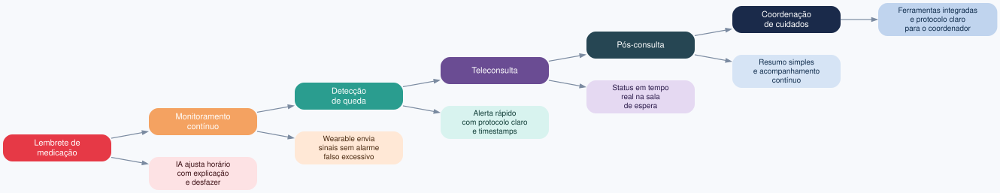
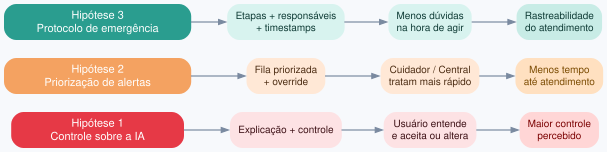
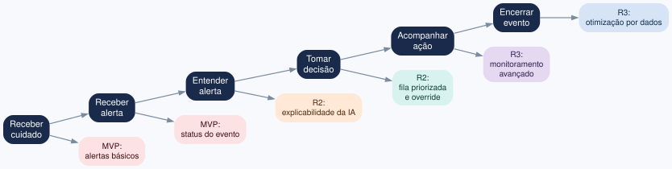
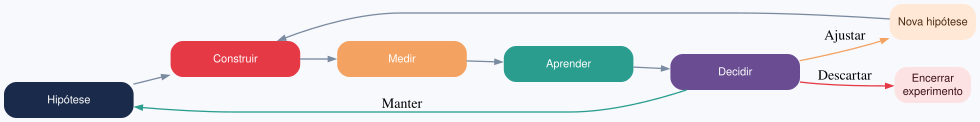
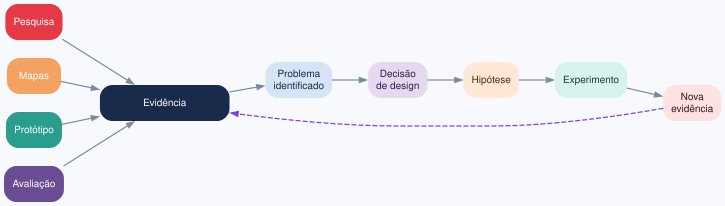
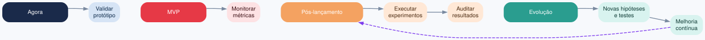

# Exercício 16 - Portfólio integrador

> Do mapa de experiência futura à apresentação final

Este portfólio reúne e organiza os principais resultados do ciclo de UX da Vitalis Care. Ele funciona como índice navegável dos artefatos entregues e não substitui os exercícios anteriores: cada decisão aqui pode ser rastreada até o exercício correspondente no repositório.

## Sumário

- [1. Visão geral](#1-visão-geral)
- [2. Índice dos artefatos](#2-índice-dos-artefatos)
- [3. Mapa de experiência futura](#3-mapa-de-experiência-futura)
- [4. Hipóteses de design](#4-hipóteses-de-design)
- [5. Alinhamento com usabilidade e confiança](#5-alinhamento-com-usabilidade-e-confiança)
- [6. User Story Mapping](#6-user-story-mapping)
- [7. Lean Startup e validação pós-lançamento](#7-lean-startup-e-validação-pós-lançamento)
- [8. Integração entre evidências e decisões](#8-integração-entre-evidências-e-decisões)
- [9. Narrativa para os stakeholders](#9-narrativa-para-os-stakeholders)
- [10. Principais decisões de design](#10-principais-decisões-de-design)
- [11. Riscos e próximas validações](#11-riscos-e-próximas-validações)
- [12. Roadmap de validação](#12-roadmap-de-validação)
- [13. Checklist do ciclo](#13-checklist-do-ciclo)
- [14. Conclusão](#14-conclusão)

---

## 1. Visão geral

O portfólio projeta a experiência futura dos **alertas inteligentes da Vitalis Care**, considerando a jornada completa do usuário — do lembrete de medicação ao monitoramento contínuo e à resposta a emergências, envolvendo paciente, cuidador, wearable, IA, central e profissionais de saúde.

O trabalho busca equilibrar agência do usuário, explicabilidade, segurança, fairness, accountability, inclusiveness, redução de falsos alarmes, comunicação clara e validação contínua após o lançamento.

---

## 2. Índice dos artefatos

### Fundamentos e mapeamento

| Exercício | Artefato | Relação com o portfólio |
|---|---|---|
| [Exercício 1](exercicio1.md) | Diagramas de alinhamento | Define perspectivas e finalidades dos principais mapas |
| [Exercício 2](exercicio2.md) | Jornada da teleconsulta | Identifica etapas, atores, ações e pontos de contato |
| [Exercício 3](exercicio3.md) | CJM e gaps emocionais | Relaciona ações, emoções, touchpoints e oportunidades |
| [Exercício 4](exercicio4.md) | Service Blueprint | Mostra a relação entre experiência, atendimento e processos internos |
| [Exercício 5](exercicio5.md) | Experience Map e Mental Model | Identifica dificuldades no lembrete e gaps cognitivos |
| [Exercício 6](exercicio6.md) | Ecossistema e integrações | Representa pacientes, cuidadores, wearable, IA, central e farmácia |
| [Exercício 7](exercicio7.md) | Jornada do coordenador | Identifica necessidades, ferramentas e fricções da operação |
| [Exercício 8](exercicio8.md) | Roadmap estratégico | Organiza prioridades de produto para evolução da solução |
| [Exercício 9](exercicio9.md) | Escopo e prototipação | Define o que entra e o que fica fora do ciclo |
| [Exercício 10](exercicio10.md) | Pesquisa, requisitos e arquitetura | Conecta pesquisa exploratória aos requisitos e ao protótipo |
| [Exercício 11](exercicio11.md) | Protótipo de alta fidelidade com IA | Registra iteração, refinamento e comparação de ferramentas |

### Usabilidade, confiança e ética

| Exercício | Artefato | Relação com o portfólio |
|---|---|---|
| [Exercício 12](exercicio12.md) | Protótipo funcional de onboarding | Demonstra a implementação funcional do fluxo |
| [Exercício 13](exercicio13.md) | Princípios de usabilidade | Define decisões de interface relacionadas a agência e explicabilidade |
| [Exercício 14](exercicio14.md) | Fairness, Accountability, Safety e Inclusiveness | Define riscos éticos e dimensões de confiança |
| [Exercício 15](exercicio15.md) | Teste de usabilidade e priorização | Organiza achados, prioridades e oportunidades |

### Protótipo funcional

- [Frontend](frontend/)
- [Backend](backend/)
- [README do projeto](README.md)

---

## 3. Mapa de experiência futura

O mapa consolida os aprendizados dos exercícios anteriores em uma jornada única de alertas inteligentes, cobrindo interpretação, decisão, atendimento, acompanhamento e coordenação.

| Fase | Experiência desejada | Hipótese de solução |
|---|---|---|
| Lembrete de medicação | IA ajusta horário com explicação e opção de desfazer | Onboarding com explicabilidade e controle |
| Monitoramento contínuo | Wearable envia sinais sem alarme falso excessivo | Fila priorizada e override da IA |
| Detecção de queda | Alerta chega rapidamente ao cuidador e à central | Protocolo claro e timestamps por etapa |
| Teleconsulta | Paciente sabe exatamente o status da consulta | Status em tempo real na sala de espera |
| Pós-consulta | Resumo claro e acompanhamento contínuo | Resumo em linguagem simples + suporte |
| Coordenação de cuidados | Coordenador possui ferramentas integradas e protocolo claro | Onboarding simulado e mentoria |

---

## 4. Hipóteses de design

### Hipótese 1 — Controle sobre a IA

**Se** apresentarmos ao paciente e ao cuidador o motivo de cada ajuste automático, com opções de aceitar, ajustar, pausar ou desfazer, **para** usuários que recebem recomendações da IA, **esperamos** aumentar a compreensão e a sensação de controle.

**Métricas:** compreensão do motivo do ajuste; percentual de ajustes aceitos; percentual de ajustes revertidos; quantidade de dúvidas sobre a IA.

### Hipótese 2 — Priorização de alertas

**Se** organizarmos os alertas em uma fila priorizada por gravidade e contexto, com possibilidade de override da IA, **para** cuidadores e profissionais da central, **esperamos** reduzir o tempo para identificar e tratar eventos críticos.

**Métricas:** tempo até identificação; tempo até atendimento; quantidade de falsos alarmes; alertas reclassificados manualmente.

### Hipótese 3 — Protocolo de emergência

**Se** apresentarmos um protocolo de escalonamento com etapas, responsáveis e timestamps, **para** cuidadores e profissionais da central em situações de emergência, **esperamos** reduzir dúvidas sobre quem deve agir e melhorar a rastreabilidade.

**Métricas:** tempo entre etapas; escalonamentos incorretos; alertas sem responsável; compreensão do protocolo.

---

## 5. Alinhamento com usabilidade e confiança

| Objetivo | Alinhamento | Inconsistência |
|---|---|---|
| Agência do usuário | O mapa inclui desfazer, ajustar e pausar | Nenhuma significativa |
| Explicabilidade | O motivo do ajuste fica visível | Falta definir padrão visual único |
| Fairness | Diferentes grupos são considerados | Ainda não detalha acessibilidade rural |
| Safety | Existe protocolo de escalonamento | Falta métrica de erro clínico ligada ao mapa |
| Inclusiveness | Linguagem simples e controles acessíveis | Necessário testar com baixa alfabetização digital |

---

## 6. User Story Mapping

**Backbone da experiência:** receber cuidado → receber alerta → entender alerta → tomar decisão → acompanhar ação → encerrar evento.

| Etapa | User story |
|---|---|
| Receber alerta | Como cuidador, quero receber alertas relevantes para saber quando preciso agir |
| Entender alerta | Como cuidador, quero entender por que o alerta foi gerado |
| Tomar decisão | Como cuidador, quero aceitar, ajustar ou contestar uma recomendação |
| Acompanhar ação | Como cuidador, quero saber quem está tratando o alerta |
| Encerrar evento | Como cuidador, quero registrar o encerramento para manter o histórico |

**Releases:**
- **MVP:** alertas básicos, status do evento, protocolo inicial.
- **Release 2:** explicabilidade da IA, fila priorizada, override manual.
- **Release 3:** personalização, monitoramento avançado, otimização baseada em dados.

---

## 7. Lean Startup e validação pós-lançamento

A validação não termina com o lançamento. O ciclo é **Construir → Medir → Aprender → Ajustar**.

| Etapa | Atividade | Evidência |
|---|---|---|
| Construir | Criar pequena alteração no produto | Protótipo ou funcionalidade |
| Medir | Observar comportamento real | Métricas e eventos |
| Aprender | Comparar resultado com a hipótese | Análise dos dados |
| Decidir | Manter, ajustar ou descartar | Decisão registrada |

---

## 8. Integração entre evidências e decisões

| Evidência | Decisão derivada | Artefato |
|---|---|---|
| Pesquisa exploratória | Simplificar linguagem e reduzir complexidade | [Exercício 10](exercicio10.md) |
| Jornada do usuário | Melhorar comunicação durante a experiência | [Exercício 3](exercicio3.md) |
| Service Blueprint | Definir responsabilidades e escalonamento | [Exercício 4](exercicio4.md) |
| Ecossistema | Considerar relações entre atores e sistemas | [Exercício 6](exercicio6.md) |
| Jornada da equipe | Melhorar ferramentas e protocolos da operação | [Exercício 7](exercicio7.md) |
| Roadmap | Priorizar melhorias de maior impacto | [Exercício 8](exercicio8.md) |
| Escopo | Definir o que entra no ciclo | [Exercício 9](exercicio9.md) |
| Princípios de usabilidade | Garantir agência e explicabilidade | [Exercício 13](exercicio13.md) |
| Avaliação ética | Considerar fairness, accountability, safety e inclusiveness | [Exercício 14](exercicio14.md) |
| Protótipo funcional | Validar o fluxo antes de uma implementação maior | [Exercício 12](exercicio12.md) |

---

## 9. Narrativa para os stakeholders

A Vitalis Care possui diferentes pontos de contato entre paciente, cuidador, central, profissionais de saúde e tecnologia. O desafio não é apenas gerar alertas, mas garantir que eles sejam **compreensíveis, acionáveis, seguros e adequados ao contexto do usuário**.

Um alerta pode começar com um sinal do wearable, passar pela IA, chegar ao cuidador, ser analisado pela central e terminar com um atendimento ou acompanhamento. Uma falha em qualquer etapa compromete a experiência completa.

O roadmap do próximo trimestre concentra os requisitos identificados nos mapas em cinco frentes: alerta de emergência, status da teleconsulta, explicabilidade do lembrete, capacitação da equipe e integração segura com a farmácia.

---

## 10. Principais decisões de design

### 10.1 Explicar a IA

O usuário deve entender o que foi alterado, por que foi alterado, e poder aceitar, ajustar, desfazer ou pausar. Essa decisão está diretamente relacionada aos princípios de usabilidade do [Exercício 13](exercicio13.md).

### 10.2 Priorizar alertas

Nem todos os eventos têm a mesma gravidade. A experiência futura propõe uma fila priorizada para facilitar a identificação dos eventos críticos. Relaciona-se ao [Exercício 4](exercicio4.md), [Exercício 7](exercicio7.md) e [Exercício 8](exercicio8.md).

### 10.3 Manter controle humano

A automação não elimina a intervenção humana. O sistema deve permitir que decisões automáticas sejam revisadas ou substituídas, conforme o framework de confiança do [Exercício 14](exercicio14.md).

---

## 11. Riscos e próximas validações

| Risco | Próxima validação |
|---|---|
| Usuário não entender a explicação da IA | Teste de compreensão |
| Excesso de alertas | Teste de carga e priorização |
| Falsos positivos | Monitoramento de eventos reais |
| Exclusão de usuários com baixa familiaridade digital | Teste com diferentes perfis |
| Desempenho diferente entre contextos | Auditoria de fairness |
| Erro em situação crítica | Simulação de emergência |
| Dependência excessiva da automação | Teste de override humano |

---

## 12. Roadmap de validação

| Área | Indicador |
|---|---|
| Agência | Taxa de ajustes e reversões |
| Explicabilidade | Compreensão do motivo do alerta |
| Safety | Tempo de resposta e erros de escalonamento |
| Fairness | Diferença de desempenho entre grupos |
| Inclusiveness | Taxa de sucesso em diferentes perfis |
| Operação | Tempo médio de tratamento |
| Confiabilidade | Taxa de falsos alarmes |

---

## 13. Checklist do ciclo

- [x] Pesquisa realizada
- [x] Jornadas mapeadas
- [x] Ecossistema identificado
- [x] Service Blueprint desenvolvido
- [x] Escopo definido
- [x] Requisitos levantados
- [x] Protótipo desenvolvido
- [x] Princípios de usabilidade definidos
- [x] Avaliação de Fairness realizada
- [x] Avaliação de Accountability realizada
- [x] Avaliação de Safety realizada
- [x] Avaliação de Inclusiveness realizada
- [x] Framework de confiança definido
- [x] Mapa de experiência futura definido
- [x] Hipóteses de design formuladas
- [x] User Story Mapping definido
- [x] Estratégia Lean Startup definida
- [x] Métricas de validação definidas

---

## 14. Conclusão

O portfólio integra os resultados do ciclo de UX da Vitalis Care em uma sequência que conecta **evidência → problema → decisão → hipótese → experimento → nova evidência**. O mapa de experiência futura mostra como os alertas inteligentes podem acompanhar diferentes momentos da jornada, enquanto as hipóteses de design definem o que ainda precisa ser testado.

Os princípios de usabilidade e o framework de confiança permanecem como critérios para a evolução do produto. A partir do lançamento, a proposta é manter ciclos curtos de validação — **Construir → Medir → Aprender → Ajustar** — para que cada nova evolução seja rastreada até uma evidência antes de ser ampliada.

---

## Navegação rápida

| Se você quer entender... | Consulte |
|---|---|
| Os fundamentos dos mapas | [Exercício 1](exercicio1.md) |
| A jornada de teleconsulta | [Exercício 2](exercicio2.md) |
| A experiência completa da teleconsulta | [Exercício 3](exercicio3.md) |
| O fluxo de emergência | [Exercício 4](exercicio4.md) |
| O lembrete de medicação | [Exercício 5](exercicio5.md) |
| O ecossistema da solução | [Exercício 6](exercicio6.md) |
| A jornada da equipe | [Exercício 7](exercicio7.md) |
| O roadmap estratégico | [Exercício 8](exercicio8.md) |
| O escopo do ciclo | [Exercício 9](exercicio9.md) |
| A pesquisa e os requisitos | [Exercício 10](exercicio10.md) |
| As ferramentas de prototipação | [Exercício 11](exercicio11.md) |
| O protótipo funcional | [Exercício 12](exercicio12.md) |
| Os princípios de usabilidade | [Exercício 13](exercicio13.md) |
| Os riscos éticos e confiança | [Exercício 14](exercicio14.md) |
| O teste de usabilidade | [Exercício 15](exercicio15.md) |
| O código e execução do protótipo | [README.md](README.md) |